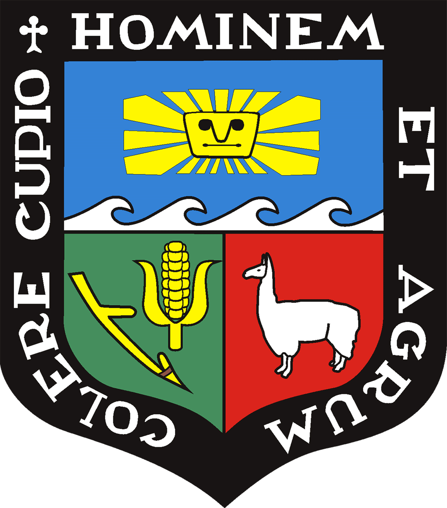

# 📊 TRABAJOS DE TÉCNICAS MULTIVARIADA

### Universidad

 

## 👨‍💻 Integrantes

| N° | Apellidos y nombres |
|:--:|---------------------|
| 1 | **Alva Aquino, Brian** |
| 2 | **Condori Cieza, Esther Elizabeth** |
| 3 | **Malvacedo Quionez, Jean Franco** |
| 4 | **Mata Sotelo, Estiven Aldair** |
| 5 | **Palma Cruz, Kesdine Yasmin** |

 

---

### 📚 Repositorio destinado a la presentación y desarrollo de trabajos del curso de Técnicas Multivariada.

